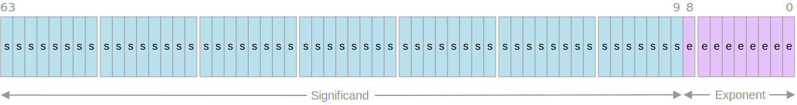
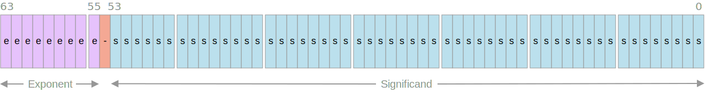

<p align="center">
    
</p>

<p align="center">
    <a href="https://swift.org/about/#swiftorg-and-open-source"></a>
    <a href="http://doge.mit-license.org"></a>
</p>

This library provides:
- `Decimal64`: Custom decimal number value type of 64-bit size. It supports up to 16 decimal digits of accuracy.
- `DecimalFP64`: IEEE 754 compliant decimal number value type of 64-bit size. It supports up to 16 decimal digits of accuracy.
- Conversion to and from Swift number types to decimal numbers.

The decimal number types have no dependencies (not even Foundation) and work on any OS supporting Swift 5.1 or later.

## Types

- `Decimal64`.

  Custom decimal number value type focused on speed. It conforms to `SignedNumeric`, `Strideable`, but not `FloatingPoint`. It has no support for `+`/`-` Infinity and ignores NaNs.

  ```swift
  let pi: Decimal64 = .pi
  let multiplier: Decimal64 = 2.5
  let bias = Decimal64(7, power: 3)  // 7 * 10^3
  let divisor: Decimal64 = "0.953"   // Supports string-number conversion
  let resultA = pi * multiplier + bias / divisor
  let resultB = resultA >> 2         // Divide by 100 (i.e. 10^-2)
  ```

  The decimal number uses an internal 64-bit composed of two values: significand and exponent. Decimal numbers use the formula `significand * 10 ^ exponent`. The internal values use two's complement.

  <p align="center">
    
  </p>

- `DecimalFP64`.

  Decimal number conforming to the `FloatingPoint` trying to follow IEEE 754 as closely as possible and supports `+`/`-` Infinity, signed zeros, and NaNs.

  The decimal number uses an internal 64-bit composed of three values: exponent, sign, and significand. Decimal numbers use the formula `sign * significand * 10 ^ exponent`.

  <p align="center">
    
  </p>

  > `DecimalFP64` is a work-in-progress and it still lacks some functionality. Don't use it in production code.

- Foundation's `Decimal`.

  Reference decimal number type of 160-bit size. It is implemented in Objective-C which doesn't conform to `FloatingPoint`. It is not very good for performant sensitive processing (overhead on retain/release and general processing).

- Swift's `Double`.

  Value binary floating-point type with 64-bit backed by fast hardware support. As it is well known, binary floating points are unable to express certain decimal numbers.

## Performance

This Swift package contains a small benchmarking command-line application. The benchmark measures the performance of a few basic operations (`+`, `*`, `/`, and string conversion) for the previously defined floating-point types: `Decimal64`, `DecimalFP64`, `Decimal`, and `Double`.

The results vary depending on the host machine and OS, but in the author's machine (compiling for release):

|          Type         |Duration (secs)|
|-----------------------|:-------------:|
|`Decimal64`            |1.026
|`DecimalFP64`          |1.087
|`Double`               |1.381
|`Decimal`              |5.137
|`Double` (generic)     |1.823
|`DecimalFP64` (generic)|1.786

Be sure to compile and run for release. It doesn't make sense to measure performance with debug configuration for several reasons:
- The Swift Standard Library and Foundation linked are already compiled for release.
- The provided decimal numbers heavily rely on inlineable functionality and Swift optimizations.